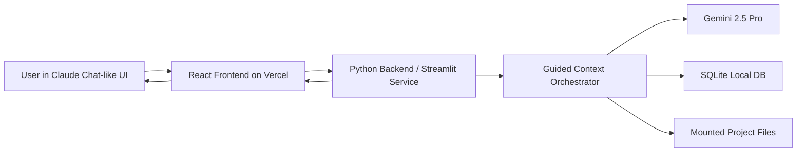
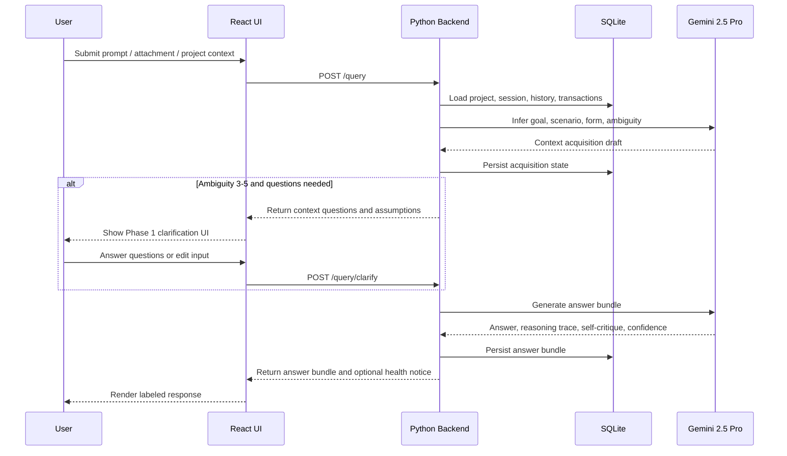

# Claude Chat Guided Context Prototype Architecture

## 1. Product Intent

This prototype extends the existing Claude Chat web app experience without changing its core operating model or visual system.

The user should feel like they are still testing inside Claude Chat:

- Same compact app shell, sidebar, composer, typography, spacing, neutral surfaces, and restrained accent usage.
- Same project-oriented mental model: sessions, files, attachments, mounted folders, edits, reversions, and agentic execution.
- Same human-in-the-loop posture: the agent proposes or prepares changes, and the human accepts application.

The new layer is the **Guided Context & Legible Answering** protocol. It makes every agent response explicit about:

- What context was needed.
- What assumptions were made.
- What answer was produced.
- How the user should judge that answer.
- When long conversations need a health warning and handoff summary.

## 2. Existing Claude Chat Operating Model

The base app is treated as already available.

Core capabilities assumed present:

- Text prompts.
- File and image attachments.
- Mounted folders or complete project context.
- Reading and modifying files.
- Creating new files.
- Editing code, text, architecture, and config files.
- Human approval for applying edits.
- Deep within-project history.
- Cross-chat history inside a project.
- Multiple chats per project.
- Deep chats within each chat.
- Image reading.
- Agentic multi-step execution.
- Running local tasks and commands.
- Reverting to prior states or transactions.
- Minor existing Claude Chat app features.

Explicit constraint:

- The system reads images but does not create images inside this product workflow.
- Audio input is ignored.

## 3. New Protocol Layer

Every user query flows through two mandatory phases, plus a continuous conversation-health monitor.

### Phase 1: Context Acquisition

Purpose:

- Understand the user query before answering.
- Avoid unnecessary questions.
- Surface assumptions clearly.
- Let the user refine or edit their input before the answer is generated.

Internal inference model:

- `goal`: the outcome the user actually wants.
- `scenario`: the domain or situation.
- `form`: the answer type needed, such as fix, recommendation, explanation, or options.
- `ambiguity`: score from 1 to 5.

Ambiguity control:

- `1-2`: skip questions or ask none; proceed with assumptions.
- `3-5`: slow down and acquire context.

User-facing behavior:

- If context is needed, show a one-line nudge describing the categories of information that would improve reliability.
- Ask only decision-changing questions.
- Ask no more than 2-3 questions.
- For gaps not asked about, show assumptions as `I'm assuming [X].`
- Ignore irrelevant oversharing.
- Flag conflicting details and ask which detail matters more.

Exit states:

- `enough_context`: answer confidently.
- `partial_context`: answer with targeted caveats.
- `insufficient_context`: state what is missing and do not guess.

### Phase 2: Answer and Evaluation

Every answer is a four-part bundle.

Required output labels:

1. `ANSWER`
2. `REASONING TRACE`
3. `SELF-CRITIQUE`
4. `CONFIDENCE`

Behavior:

- The answer should never be bare.
- The reasoning trace should explain why the answer follows from the user inputs.
- Assumptions must be listed where they materially affect the answer.
- The response must say what private user knowledge could change the answer.
- Self-critique must be specific, not generic.
- At least one alternative interpretation or approach must be included.
- Confidence must include:
  - Reasoning confidence.
  - Verifiability: checkable external fact vs judgment call.

### Continuous Conversation-Health Monitor

Trigger when either condition is true:

- Around 20 or more exchanges.
- Drift signals appear, such as contradictions, topic wandering, or re-litigating settled points.

When triggered, append a `HEALTH NOTICE` block:

- Warn that long threads risk drift or confabulation.
- Recommend a fresh start when reliability matters.
- Provide an editable handoff summary:
  - Goal.
  - Decisions and constraints already settled.
  - Questions still open.
  - Assumptions currently in play.

## 4. High-Level System Architecture



## 5. Frontend Architecture

Technology:

- React JS.
- Vercel deployment.
- Claude Chat visual system only.

Frontend responsibilities:

- Render the Claude Chat-style shell.
- Render project/session/chat surfaces.
- Render Phase 1 context acquisition UI.
- Render assumptions and question prompts.
- Regenerate Phase 1 after each user clarification instead of showing a static questionnaire.
- Render Phase 2 answer bundle.
- Render health notices.
- Send prompts, files metadata, session state, and user clarification answers to backend.
- Never call Gemini directly.
- Never expose `GEMINI_API_KEY`.

Frontend environmental config:

- `VITE_API_BASE_URL`: backend URL used by the frontend.

Design constraints:

- Use the existing Claude Chat app aesthetic.
- Avoid new brand styles.
- Avoid marketing-page patterns.
- Keep UI compact, quiet, utility-first, and workspace-like.
- Preserve the composer-first interaction model.
- New protocol UI should feel like native Claude Chat response structure, not a separate product bolted on.

Suggested UI surfaces:

- `ContextReviewPanel`: one-line reliability nudge, decision-changing questions, assumptions.
- `AnswerBundle`: four labeled response sections.
- `HealthNotice`: editable handoff summary.
- `SessionTimeline`: transaction points and revert affordances.
- `ProjectMemoryPanel`: project-scoped history and cross-chat context.

## 6. Backend Architecture

Technology:

- Python.
- Streamlit-backed local/backend service.
- SQLite for local persistence.
- Gemini 2.5 Pro for agentic reasoning.

Backend responsibilities:

- Receive user input from frontend.
- Receive attached file context from the Claude Chat-style composer.
- Load project/session/chat context.
- Run Phase 1 inference.
- Decide whether clarification is needed.
- Persist assumptions, questions, answers, and transaction state.
- Call Gemini for reasoning and answer generation.
- Enforce the mandatory four-part answer bundle.
- Track conversation health.
- Store health notice handoff summaries.
- Manage file read/write proposals and transaction metadata.

Backend environmental config:

- `GEMINI_API_KEY`: server-side only.
- `GOOGLE_API_KEY`: accepted as an alternate server-side Gemini key name.
- `GEMINI_MODEL=gemini-2.5-pro`.
- `SQLITE_DB_PATH`: local SQLite database path.
- `STREAMLIT_BACKEND_URL`: local backend URL.

## 7. Gemini Integration Boundary

Gemini is used only from the backend.

Recommended responsibilities for Gemini:

- Act as the central Phase 1 context-acquisition intelligence.
- Infer goal, scenario, form, and ambiguity.
- Dynamically decide which context questions are worth asking.
- Draft assumptions.
- Flag wrong, conflicting, or overfit user input before answer generation.
- Surface likely repercussions for file modifications across dependent code, tests, docs, config, and data.
- Generate answer bundle.
- Produce self-critique and confidence statements.
- Produce conversation-health summaries.
- Assist with agentic task planning.

Do not let Gemini directly:

- Mutate files without transaction tracking.
- Bypass human approval.
- Read secrets intended only for backend config.
- Return unlabeled bare answers.

Every model output should be validated or normalized by backend code before returning to the frontend.

## 8. SQLite Data Model

Initial tables:

### `projects`

- `id`
- `name`
- `root_path`
- `created_at`
- `updated_at`

### `sessions`

- `id`
- `project_id`
- `title`
- `created_at`
- `updated_at`
- `health_status`

### `messages`

- `id`
- `session_id`
- `role`
- `content`
- `created_at`
- `phase`
- `transaction_id`

### `context_acquisitions`

- `id`
- `session_id`
- `message_id`
- `goal`
- `scenario`
- `answer_form`
- `ambiguity_score`
- `exit_state`
- `created_at`

### `clarifying_questions`

- `id`
- `context_acquisition_id`
- `question`
- `user_answer`
- `is_decision_changing`
- `created_at`

### `assumptions`

- `id`
- `context_acquisition_id`
- `assumption`
- `status`
- `created_at`

Allowed `status` values:

- `active`
- `vetoed`
- `confirmed`

### `answer_bundles`

- `id`
- `session_id`
- `message_id`
- `answer`
- `reasoning_trace`
- `self_critique`
- `reasoning_confidence`
- `verifiability`
- `created_at`

### `health_notices`

- `id`
- `session_id`
- `trigger_reason`
- `goal_summary`
- `settled_constraints`
- `open_questions`
- `active_assumptions`
- `created_at`

### `transactions`

- `id`
- `session_id`
- `parent_transaction_id`
- `description`
- `state_snapshot_ref`
- `created_at`

### `file_events`

- `id`
- `transaction_id`
- `path`
- `event_type`
- `before_ref`
- `after_ref`
- `requires_approval`
- `approval_status`
- `created_at`

## 9. Request Lifecycle



## 10. API Shape

Initial endpoints:

### `POST /query`

Input:

- `project_id`
- `session_id`
- `prompt`
- `attachments`
- `mounted_paths`
- `current_transaction_id`

Output:

- `phase`
- `exit_state`
- `context_acquisition`
- `questions`
- `assumptions`
- `answer_bundle`
- `health_notice`

### `POST /query/clarify`

Input:

- `context_acquisition_id`
- `answers`
- `edited_prompt`
- `assumption_overrides`
- `previous_context`
- `attachments`

Output:

- `phase`
- `exit_state`
- Regenerated `questions`, with answers already covered removed.
- `answer_bundle`
- `health_notice`

### `POST /transactions/revert`

Input:

- `session_id`
- `transaction_id`

Output:

- `active_transaction_id`
- `restored_state`

### `GET /sessions/:id/history`

Output:

- Messages.
- Context acquisitions.
- Assumptions.
- Answer bundles.
- Transactions.
- Health notices.

## 11. Prompt Contract for Backend

The backend should enforce this contract around Gemini calls:

```text
You are operating inside a Claude Chat-like project assistant.
Do not produce a bare answer.
Follow Guided Context & Legible Answering.

Phase 1:
- Infer goal, scenario, form, ambiguity.
- Ask only decision-changing questions.
- Surface assumptions for gaps not asked about.
- Choose an exit state.

Phase 2:
- Return exactly these sections:
  1. ANSWER
  2. REASONING TRACE
  3. SELF-CRITIQUE
  4. CONFIDENCE

Continuous:
- If conversation health trigger applies, append HEALTH NOTICE.
```

The backend should prefer structured JSON responses from Gemini, then render them into the Claude Chat-style UI.

## 12. Implementation Sequence

Build one phase at a time.

1. Lock the Claude Chat visual shell.
2. Add frontend response layout for the four answer sections.
3. Add Phase 1 context acquisition UI.
4. Add local Python backend skeleton.
5. Add SQLite schema and persistence.
6. Add Gemini 2.5 Pro inference for Phase 1.
7. Add Gemini answer bundle generation for Phase 2.
8. Add conversation-health monitor.
9. Add transaction and revert metadata integration.
10. Prepare Streamlit backend console deployment.
11. Prepare Python REST API deployment for the Vercel frontend.
12. Prepare Vercel frontend deployment.
13. Wire deployed frontend to backend URL.

## 13. Non-Goals for Initial Prototype

- Rebuilding the whole Claude Chat app.
- Introducing a new visual identity.
- Direct Gemini calls from frontend.
- Full production auth.
- Cloud database migration.
- Audio support.
- Image generation.

## 14. Open Decisions

- When to migrate prototype SQLite persistence to a managed database.
- How file snapshots are stored for revert support.
- Whether project memory is embedded, summarized, or both.
- Whether health notices are generated deterministically, by Gemini, or by a hybrid approach.
- How much of the existing Claude Chat transaction model is mock data in the prototype.

## 15. Deployment Decision

The approved deployment topology is:

- Vercel hosts the React/Vite frontend.
- `backend.server` is the Python REST API consumed by the Vercel frontend.
- `backend.streamlit_app` is the Streamlit backend console for Phase 1/Phase 2 smoke testing, file-upload checks, Gemini secret validation, and operational inspection.

Streamlit is intentionally not treated as the REST API surface because Streamlit Community Cloud is designed around Streamlit app entrypoints, not arbitrary `/phase1` and `/phase2` HTTP routes.
